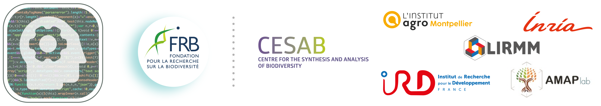

## Workshop website

<!-- badges: start -->

<!-- badges: end -->

Source of the [workshop](https://ai-ecol.github.io/) **_AI for ecologists : a toolkit_**
organized by the 
[FRB-CESAB](https://www.fondationbiodiversite.fr/en/about-the-foundation/le-cesab/).

The course material currently online is from the 2025 edition and will be updated for the 2026 edition. Feel free to share or reuse <3 .

### Citation

> Blondel L, Bourel B, Challand M, Coux C, Justeau-Allaire D, Frelat R, Servajean M, Tieo S.M., Tresson P. (2026) AI for ecologists: a toolkit for beginners. An FRB-CESAB training course. URL: https://ai-ecol.github.io/

Website built with :heart: with 
[`Quarto`](https://quarto.org/) & 
[`GitHub Actions`](https://github.com/features/actions).
