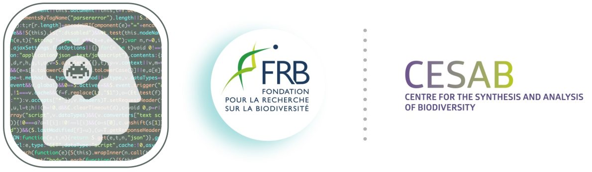

## Workshop website

<!-- badges: start -->

<!-- badges: end -->

Source of the [workshop](https://ai-ecol.github.io/) **_AI for ecologists_**
organized by the 
[FRB-CESAB](https://www.fondationbiodiversite.fr/en/about-the-foundation/le-cesab/).

#### ⚠️ **Work in progress**

### Citation

> Coux c, Ayata S-D, Blondel L, Justea-Allaire D, Servajean M, Tresson P. (2024) AI for ecologists: a toolkit for beginners. An FRB-CESAB training course. URL: <https://ai-ecol.github.io/>

Website built with :heart: with 
[`Quarto`](https://quarto.org/) & 
[`GitHub Actions`](https://github.com/features/actions).
